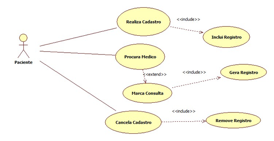

# Casos de uso

## 1. Diagrama de casos de uso

**Instruções do professor**: Insira abaixo o diagrama com os casos de uso do seu sistema. A imagem abaixo é somente um exemplo.

## 2. Especificação dos casos de uso

**Instruções do professor**: Para cada caso de uso, criar as tabelas com a especificação do caso de uso. Siga o exemplo dado abaixo:

### 2.1. Caso de uso **Realiza Cadastro**

| Campo          | Informação        |
|---|---|
| Identificador: | UC01              |
| Nome:          | Realiza Cadastro |
| Atores:        | Cliente |
| Sumário:       | Realiza um cadastro de cliente. |

| Fluxo Principal |
|---|
| 1) O cliente entra na aba cadastro e fornece as informações pessoais. |
| 2) O sistema salva informações do cliente.                   |
| 3) O sistema apresenta que os dados foram guardados e seu cadastro foi realizado com sucesso. |
| 4) O cliente retorna a pagina inical do site. |

| Fluxo Alternativo (2a): O sistema nâo conseguiu realizar o cadastro. |
|---|
| 1) O sistema informa está faltando alguma informação para o realizamento do cadastro. |
| 2) O sistema faz o usuario preencher novamente o formulario. |
| 3) O cliente preenche o formulario. |
| 4) Volta ao passo (2) do fluxo principal. |

### 2.2. Caso de uso **Busca Médico**

| Campo          | Informação        |
|---|---|
| Identificador: | UC02              |
| Nome:          | Busca Médico |
| Atores:        | Cliente |
| Sumário:       | Faz uma busca por médicos em sua regi. |

| Fluxo Principal |
|---|
| 1) O cliente entra em um formulario e informa dados de medico e sua localização. |
| 2) O sistema lista as informações de acordo com a solicitação.                   |

| Fluxo Alternativo (2a): O sistema nâo achou conseguiu retornar resposta. |
|---|
| 1) O sistema nâo retorna nenhuma resposta ao pedido. |
| 2) Volta ao passo (1) do fluxo principal. |

**Instruções do professor**: As tabelas acima mostram um exemplo de especificação de **um único caso de uso**. Lembre-se de especificar cada um dos casos de uso.

